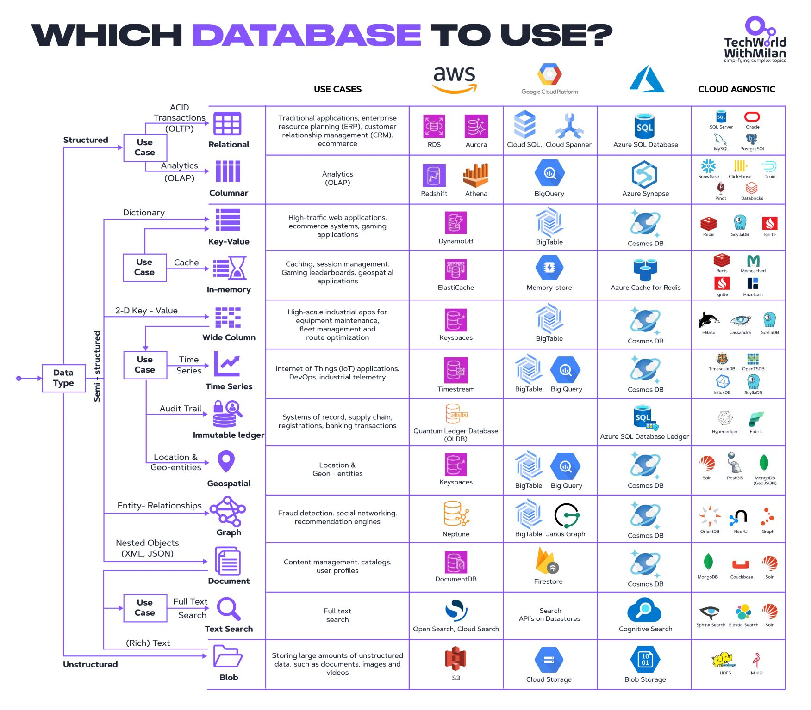

# Which Database to Use?

Ce document résume les grandes familles de bases de données et compare les principales solutions disponibles dans chaque catégorie. L’objectif est d’offrir une vision claire pour choisir la bonne technologie en fonction du contexte.

---

## 1. Les familles de bases de données

### Relationnelles (SQL)
- Stockent les données dans des tables avec des relations (schéma structuré).
- Idéal pour les applications traditionnelles : ERP, CRM, e-commerce.
- Garantissent des transactions ACID (Atomicité, Cohérence, Isolation, Durabilité).

### Colonnaires
- Optimisées pour l’analytique (OLAP).
- Stockage par colonne au lieu de ligne → excellentes performances pour les agrégations et requêtes BI.
- Utilisées pour data warehouses et data lakes.

### Key-Value
- Simples paires clé → valeur.
- Idéal pour sessions, caches, systèmes à fort trafic.
- Pas de requêtes complexes, mais très rapides.

### In-Memory
- Données stockées directement en mémoire RAM.
- Performances extrêmes, utile pour cache, temps réel, géospatial.
- Risque de perte de données si non persisté.

### Wide Column
- Stockage sous forme de familles de colonnes (hybride entre relationnel et clé-valeur).
- Excellente scalabilité horizontale.
- Idéal pour IoT, télémétrie, grands volumes distribués.

### Time Series
- Optimisées pour les données chronologiques (logs, métriques).
- Support natif du time-stamping, des intervalles et des agrégations temporelles.

### Ledger (Immuable)
- Bases qui garantissent l’immutabilité des écritures.
- Cas d’usage : audit, finance, traçabilité, supply chain.

### Geospatial
- Bases ou extensions capables de gérer des entités géographiques.
- Permettent des requêtes spatiales (distances, intersections, zones).

### Graph
- Données modélisées comme des nœuds et arêtes.
- Idéal pour les relations complexes (réseaux sociaux, moteurs de recommandation).

### Document
- Stockage de documents JSON ou BSON.
- Flexible, schéma dynamique, agile pour le développement.

### Search
- Moteurs de recherche full-text.
- Idéal pour explorer des données textuelles massives.

### Blob/Object Storage
- Stockage d’objets binaires (images, vidéos, fichiers).
- Distribué, haute disponibilité, utilisé pour l’archivage et les gros volumes.

---

## 2. Comparatifs par catégorie

### Relationnelles

| Base de données | Avantages | Inconvénients | Cas d’usage |
|-----------------|-----------|---------------|-------------|
| **PostgreSQL** | Open-source, riche en fonctionnalités (extensions comme PostGIS, TimescaleDB), robuste | Peut être limité en scalabilité horizontale | Applications critiques, systèmes transactionnels, analytics légers |
| **MySQL/MariaDB** | Populaire, facile à administrer, large communauté | Moins avancé que PostgreSQL pour certaines fonctionnalités (CTE, JSON) | Applications web, e-commerce |
| **SQL Server** | Intégration forte avec l’écosystème Microsoft, outils BI intégrés | Coût élevé des licences, orienté Windows | Entreprises Microsoft, solutions BI |
| **Oracle** | Très mature, fonctionnalités avancées (partitionnement, clustering) | Très coûteux, complexité de gestion | Banques, télécoms, grandes entreprises |

---

### Colonnaires

| Base de données | Avantages | Inconvénients | Cas d’usage |
|-----------------|-----------|---------------|-------------|
| **Snowflake** | Cloud natif, séparation stockage/calcul, facile à utiliser | Dépendance au cloud, coût selon usage | Data warehouses, BI |
| **ClickHouse** | Très rapide pour l’analytique, open-source | Complexité pour transactions | Analytics temps réel, logs |
| **Apache Druid** | Conçu pour analytics temps réel, ingestion rapide | Moins adapté aux requêtes ad-hoc complexes | Monitoring, logs, métriques |
| **Apache Pinot** | Faible latence, optimisé pour dashboards | Moins mature que Druid/ClickHouse | Analytics temps réel, OLAP interactif |
| **Databricks (Delta Lake)** | Écosystème Spark, puissant pour data science | Complexité de déploiement, coût élevé | Machine learning, data lakes |

---

### Key-Value / In-Memory

| Base de données | Avantages | Inconvénients | Cas d’usage |
|-----------------|-----------|---------------|-------------|
| **Redis** | Ultra-rapide, structures de données avancées, support pub/sub | Pas conçu pour stockage durable par défaut | Cache, sessions, géospatial |
| **Memcached** | Simple, léger, très performant | Fonctionnalités limitées par rapport à Redis | Cache distribué |
| **Aerospike** | Haute disponibilité, persistance possible | Moins répandu que Redis | Temps réel, IoT, publicité en ligne |

---

### Wide Column

| Base de données | Avantages | Inconvénients | Cas d’usage |
|-----------------|-----------|---------------|-------------|
| **Cassandra** | Scalabilité horizontale massive, tolérance aux pannes | Courbe d’apprentissage élevée | IoT, big data |
| **HBase** | Intégration Hadoop, robuste | Complexe à administrer | Big data, analytics distribués |
| **ScyllaDB** | Compatible Cassandra mais plus performant | Moins mature, communauté plus petite | Temps réel, IoT |

---

### Time Series

| Base de données | Avantages | Inconvénients | Cas d’usage |
|-----------------|-----------|---------------|-------------|
| **InfluxDB** | Optimisé time series, langage Flux | Limité hors séries temporelles | Monitoring, IoT |
| **TimescaleDB** | Extension PostgreSQL, SQL natif | Dépend de PostgreSQL | Metrics, DevOps |
| **Prometheus** | Open-source, intégration Kubernetes | Pas conçu pour stockage long terme | Monitoring systèmes |

---

### Ledger

| Base de données | Avantages | Inconvénients | Cas d’usage |
|-----------------|-----------|---------------|-------------|
| **Hyperledger** | Open-source, robuste, blockchain permissionnée | Complexité, configuration lourde | Finance, supply chain |
| **Amazon QLDB** | Ledger managé, simplicité d’utilisation | Dépendance AWS | Audit, transactions financières |
| **BigchainDB** | Base orientée blockchain | Moins répandue | Enregistrements immuables |

---

### Graph

| Base de données | Avantages | Inconvénients | Cas d’usage |
|-----------------|-----------|---------------|-------------|
| **Neo4j** | Leader du marché, langage Cypher | Version entreprise coûteuse | Social graph, recommandations |
| **JanusGraph** | Open-source, scalable, intégration Hadoop | Plus complexe que Neo4j | Analyse big data relationnelle |
| **ArangoDB** | Multi-modèle (document + graph) | Moins spécialisé que Neo4j | Cas hybrides |

---

### Document

| Base de données | Avantages | Inconvénients | Cas d’usage |
|-----------------|-----------|---------------|-------------|
| **MongoDB** | Flexible, schéma dynamique, JSON natif | Cohérence éventuelle | Catalogues, APIs rapides |
| **CouchDB** | Synchronisation facile (replication master-master) | Moins performant que MongoDB | Applications offline-first |
| **Couchbase** | JSON + indexation, haute performance | Complexité de déploiement | Mobile sync, contenu |

---

### Search

| Base de données | Avantages | Inconvénients | Cas d’usage |
|-----------------|-----------|---------------|-------------|
| **Elasticsearch** | Puissant moteur de recherche, scalabilité | Gourmand en ressources | Recherche full-text, logs |
| **OpenSearch** | Fork open-source d’Elasticsearch | Moins d’écosystème | Recherche, observabilité |
| **Apache Solr** | Basé sur Lucene, stable, mature | Plus ancien, moins moderne | Recherche texte |

---

### Blob/Object Storage

| Base de données | Avantages | Inconvénients | Cas d’usage |
|-----------------|-----------|---------------|-------------|
| **MinIO** | Compatible S3, simple, open-source | Focalisé stockage objet | Stockage cloud privé |
| **Ceph** | Très robuste, distribué | Complexité déploiement | Cloud distribué, HPC |
| **HDFS** | Intégration Hadoop, fiable | Vieillit face à alternatives modernes | Big data, batch processing |

---

## 3. Conclusion

- Les bases **relationnelles** restent incontournables pour les systèmes transactionnels classiques.  
- Les **colonnaires** dominent le monde analytique et BI.  
- Les **key-value et in-memory** sont le choix pour la performance brute (cache, temps réel).  
- Les **wide column** et **time series** répondent aux besoins big data/IoT.  
- Les **graph** brillent dès qu’il y a des relations complexes.  
- Les **document** apportent flexibilité et rapidité.  
- Les **search** sont des outils spécialisés mais incontournables.  
- Les **blob/object storages** assurent la base pour tout ce qui est fichiers massifs.