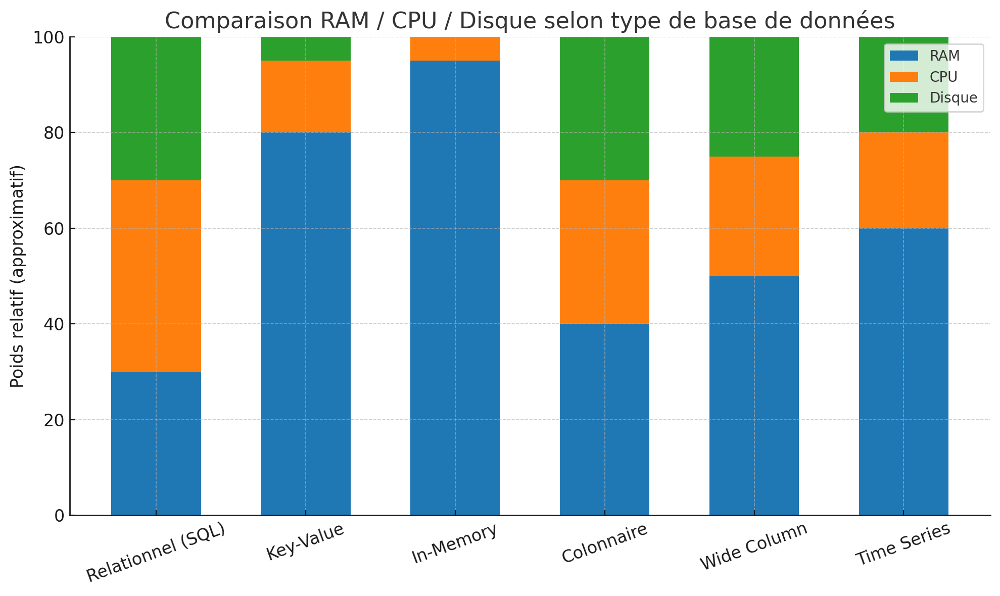

# Which Database to Use?


Ce document résume les grandes familles de bases de données et compare les principales solutions disponibles dans chaque catégorie. L’objectif est d’offrir une vision claire pour choisir la bonne technologie en fonction du contexte.

## 1. Les familles de bases de données

### Relationnelles (SQL)
- Stockent les données dans des tables avec des relations (schéma structuré).
- Idéal pour les applications traditionnelles : ERP, CRM, e-commerce.
- Garantissent des transactions ACID (Atomicité, Cohérence, Isolation, Durabilité).

**Pourquoi c’est plus efficace ?**
- Transactions ACID : chaque opération (ex : transfert bancaire) est garantie sans incohérence, même en cas de panne.  
- Indexation avancée : B-tree, hash, GIN… pour des recherches rapides même sur de grands volumes.  
- Requêtes complexes : support des jointures, agrégations, sous-requêtes → idéal pour des relations riches.  
- Optimisations matures : décennies de recherche, planificateurs de requêtes sophistiqués.  

---

### Colonnaires
- Optimisées pour l’analytique (OLAP).
- Stockage par colonne au lieu de ligne → excellentes performances pour les agrégations et requêtes BI.
- Utilisées pour data warehouses et data lakes.

**Pourquoi c’est plus efficace ?**
- Lecture sélective : seules les colonnes nécessaires sont lues (ex : moyenne des prix → on lit uniquement la colonne *prix*).  
- Compression efficace : colonnes homogènes (mêmes types) compressées fortement → moins d’espace disque et plus de rapidité.  
- Traitement vectorisé : les calculs d’agrégation exploitent le CPU de manière optimisée.  
- Séparation stockage/calcul (dans Snowflake, BigQuery) : permet de scaler indépendamment selon la charge.  

---

### Key-Value
- Simples paires clé → valeur.
- Idéal pour sessions, caches, systèmes à fort trafic.
- Pas de requêtes complexes, mais très rapides.

**Pourquoi c’est plus efficace ?**
- Complexité constante O(1) : accès direct en connaissant la clé.  
- Pas de parsing de requêtes : pas besoin d’optimiser ou interpréter du SQL.  
- Idéal pour haute fréquence : des millions de lectures/écritures par seconde possibles.  
- Très faible latence : microsecondes en mémoire, millisecondes sur disque (utilisation de la RAM).  

---

### In-Memory
- Données stockées directement en mémoire RAM.
- Performances extrêmes, utile pour cache, temps réel, géospatial.
- Risque de perte de données si non persisté.

**Pourquoi c’est plus efficace ?**
- Accès RAM : environ 100 à 1000x plus rapide qu’un accès disque.  
- TTL (time-to-live) intégré : données expirent automatiquement → pas de pollution de cache.  
- Structures optimisées (Redis, Hazelcast) : listes, sets, sorted sets, bitmaps en mémoire.  
- Réplication en mémoire : plusieurs nœuds RAM peuvent partager instantanément l’état.  

---

### Wide Column
- Stockage sous forme de familles de colonnes (hybride entre relationnel et clé-valeur).
- Excellente scalabilité horizontale.
- Idéal pour IoT, télémétrie, grands volumes distribués.

**Pourquoi c’est plus efficace ?**
- Scalabilité horizontale massive : conçu pour s’étendre sur des centaines de serveurs.  
- Tolérance aux pannes : réplication automatique des données entre nœuds.  
- Écriture rapide séquentielle (LSM-trees) : parfait pour gros volumes de logs.  
- Flexibilité par ligne : chaque clé (ligne) peut contenir un nombre variable de colonnes.  

---

### Time Series
- Optimisées pour les données chronologiques (logs, métriques).
- Support natif du time-stamping, des intervalles et des agrégations temporelles.

**Pourquoi c’est plus efficace ?**
- Index temporel : chaque donnée est rangée par timestamp → requêtes par plages rapides.  
- Compression temporelle : stocke efficacement des millions de points continus.  
- Fonctions intégrées : downsampling, moyennes mobiles, interpolations.  
- Conçues pour ingestion rapide : parfait pour métriques IoT ou monitoring.  

---

### Ledger (Immuable)
- Bases qui garantissent l’immutabilité des écritures.
- Cas d’usage : audit, finance, traçabilité, supply chain.

**Pourquoi c’est plus efficace ?**
- Append-only : impossible de supprimer ou altérer une donnée.  
- Vérifiabilité cryptographique : chaque entrée liée aux précédentes par hash.  
- Historique complet : chaque modification conserve une trace horodatée.  
- Confiance renforcée : idéal pour conformité réglementaire et finance.  

---

### Geospatial
- Bases ou extensions capables de gérer des entités géographiques.
- Permettent des requêtes spatiales (distances, intersections, zones).

**Pourquoi c’est plus efficace ?**
- Index géospatiaux (R-tree, quad-tree, GiST) : recherches spatiales rapides.  
- Fonctions spécialisées : calcul de distance, intersections, zones tampon.  
- Support natif des systèmes de coordonnées (WGS84, etc.).  
- Optimisé pour grands volumes : millions de points géographiques traités efficacement.  

---

### Graph
- Données modélisées comme des nœuds et arêtes.
- Idéal pour les relations complexes (réseaux sociaux, moteurs de recommandation).

**Pourquoi c’est plus efficace ?**
- Accès direct aux relations : au lieu de jointures coûteuses, chaque nœud connaît ses voisins.  
- Algorithmes intégrés : PageRank, shortest path, community detection.  
- Requêtes expressives : langages comme Cypher décrivent les relations naturellement.  
- Conçu pour graphe géant : réseaux sociaux, systèmes de recommandations, détection de fraude.  

---

### Document
- Stockage de documents JSON ou BSON.
- Flexible, schéma dynamique, agile pour le développement.

**Pourquoi c’est plus efficace ?**
- JSON natif : correspond directement aux objets dans le code.  
- Schéma flexible : pas besoin de migrations lourdes quand le modèle évolue.  
- Indexation riche : n’importe quel champ peut être indexé.  
- Support de requêtes complexes sur des structures imbriquées.  

---

### Search
- Moteurs de recherche full-text.
- Idéal pour explorer des données textuelles massives.

**Pourquoi c’est plus efficace ?**
- Index inversé : accès instantané aux documents contenant un mot.  
- Scoring et pertinence : classe les résultats en fonction de la proximité avec la requête.  
- Recherche tolérante aux fautes (fuzzy matching).  
- Optimisé pour données massives : logs, documents, données textuelles.  

---

### Blob/Object Storage
- Stockage d’objets binaires (images, vidéos, fichiers).
- Distribué, haute disponibilité, utilisé pour l’archivage et les gros volumes.

**Pourquoi c’est plus efficace ?**
- Scalabilité illimitée : supporte des milliards d’objets.  
- Résilience : réplique automatiquement les fichiers sur plusieurs zones.  
- Coût optimisé : stockage bas coût pour fichiers volumineux.  
- API simple : opérations PUT/GET universelles.  

---

## 2. Comparatifs par catégorie

### Relationnelles

| Base de données | Avantages | Inconvénients | Cas d’usage |
|-----------------|-----------|---------------|-------------|
| **PostgreSQL** | Open-source, riche en fonctionnalités (extensions comme PostGIS, TimescaleDB), robuste | Peut être limité en scalabilité horizontale | Applications critiques, systèmes transactionnels, analytics légers |
| **MySQL/MariaDB** | Populaire, facile à administrer, large communauté | Moins avancé que PostgreSQL pour certaines fonctionnalités (CTE, JSON) | Applications web, e-commerce |
| **SQL Server** | Intégration forte avec l’écosystème Microsoft, outils BI intégrés | Coût élevé des licences, orienté Windows | Entreprises Microsoft, solutions BI |
| **Oracle** | Très mature, fonctionnalités avancées (partitionnement, clustering) | Très coûteux, complexité de gestion | Banques, télécoms, grandes entreprises |

---

### Colonnaires

| Base de données | Avantages | Inconvénients | Cas d’usage |
|-----------------|-----------|---------------|-------------|
| **Snowflake** | Cloud natif, séparation stockage/calcul, facile à utiliser | Dépendance au cloud, coût selon usage | Data warehouses, BI |
| **ClickHouse** | Très rapide pour l’analytique, open-source | Complexité pour transactions | Analytics temps réel, logs |
| **Apache Druid** | Conçu pour analytics temps réel, ingestion rapide | Moins adapté aux requêtes ad-hoc complexes | Monitoring, logs, métriques |
| **Apache Pinot** | Faible latence, optimisé pour dashboards | Moins mature que Druid/ClickHouse | Analytics temps réel, OLAP interactif |
| **Databricks (Delta Lake)** | Écosystème Spark, puissant pour data science | Complexité de déploiement, coût élevé | Machine learning, data lakes |

---

### Key-Value / In-Memory

| Base de données | Avantages | Inconvénients | Cas d’usage |
|-----------------|-----------|---------------|-------------|
| **Redis** | Ultra-rapide, structures de données avancées, support pub/sub | Pas conçu pour stockage durable par défaut | Cache, sessions, géospatial |
| **Memcached** | Simple, léger, très performant | Fonctionnalités limitées par rapport à Redis | Cache distribué |
| **Aerospike** | Haute disponibilité, persistance possible | Moins répandu que Redis | Temps réel, IoT, publicité en ligne |

---

### Wide Column

| Base de données | Avantages | Inconvénients | Cas d’usage |
|-----------------|-----------|---------------|-------------|
| **Cassandra** | Scalabilité horizontale massive, tolérance aux pannes | Courbe d’apprentissage élevée | IoT, big data |
| **HBase** | Intégration Hadoop, robuste | Complexe à administrer | Big data, analytics distribués |
| **ScyllaDB** | Compatible Cassandra mais plus performant | Moins mature, communauté plus petite | Temps réel, IoT |

---

### Time Series

| Base de données | Avantages | Inconvénients | Cas d’usage |
|-----------------|-----------|---------------|-------------|
| **InfluxDB** | Optimisé time series, langage Flux | Limité hors séries temporelles | Monitoring, IoT |
| **TimescaleDB** | Extension PostgreSQL, SQL natif | Dépend de PostgreSQL | Metrics, DevOps |
| **Prometheus** | Open-source, intégration Kubernetes | Pas conçu pour stockage long terme | Monitoring systèmes |

---

### Ledger

| Base de données | Avantages | Inconvénients | Cas d’usage |
|-----------------|-----------|---------------|-------------|
| **Hyperledger** | Open-source, robuste, blockchain permissionnée | Complexité, configuration lourde | Finance, supply chain |
| **Amazon QLDB** | Ledger managé, simplicité d’utilisation | Dépendance AWS | Audit, transactions financières |
| **BigchainDB** | Base orientée blockchain | Moins répandue | Enregistrements immuables |

---

### Graph

| Base de données | Avantages | Inconvénients | Cas d’usage |
|-----------------|-----------|---------------|-------------|
| **Neo4j** | Leader du marché, langage Cypher | Version entreprise coûteuse | Social graph, recommandations |
| **JanusGraph** | Open-source, scalable, intégration Hadoop | Plus complexe que Neo4j | Analyse big data relationnelle |
| **ArangoDB** | Multi-modèle (document + graph) | Moins spécialisé que Neo4j | Cas hybrides |

---

### Document

| Base de données | Avantages | Inconvénients | Cas d’usage |
|-----------------|-----------|---------------|-------------|
| **MongoDB** | Flexible, schéma dynamique, JSON natif | Cohérence éventuelle | Catalogues, APIs rapides |
| **CouchDB** | Synchronisation facile (replication master-master) | Moins performant que MongoDB | Applications offline-first |
| **Couchbase** | JSON + indexation, haute performance | Complexité de déploiement | Mobile sync, contenu |

---

### Search

| Base de données | Avantages | Inconvénients | Cas d’usage |
|-----------------|-----------|---------------|-------------|
| **Elasticsearch** | Puissant moteur de recherche, scalabilité | Gourmand en ressources | Recherche full-text, logs |
| **OpenSearch** | Fork open-source d’Elasticsearch | Moins d’écosystème | Recherche, observabilité |
| **Apache Solr** | Basé sur Lucene, stable, mature | Plus ancien, moins moderne | Recherche texte |

---

### Blob/Object Storage

| Base de données | Avantages | Inconvénients | Cas d’usage |
|-----------------|-----------|---------------|-------------|
| **MinIO** | Compatible S3, simple, open-source | Focalisé stockage objet | Stockage cloud privé |
| **Ceph** | Très robuste, distribué | Complexité déploiement | Cloud distribué, HPC |
| **HDFS** | Intégration Hadoop, fiable | Vieillit face à alternatives modernes | Big data, batch processing |

## 3. Exemples pratiques

### Relationnelle (PostgreSQL)
```sql
CREATE TABLE users (
  id SERIAL PRIMARY KEY,
  name TEXT,
  email TEXT UNIQUE
);

INSERT INTO users (name, email) VALUES ('Alice', 'alice@example.com');
SELECT * FROM users WHERE email = 'alice@example.com';
```

### Colonnaire (Snowflake)
```sql
CREATE TABLE ventes (
  id INT,
  produit STRING,
  prix FLOAT,
  date_vente DATE
);

SELECT produit, AVG(prix) FROM ventes GROUP BY produit;
```

### Key-Value / In-Memory (Redis)
```bash
SET user:123:orders '[{"id":987,"produit":"Chaussures"},{"id":988,"produit":"Livre"}]'
GET user:123:orders
```

### Wide Column (Cassandra)
```sql
CREATE TABLE capteurs (
  device_id TEXT,
  timestamp TIMESTAMP,
  temperature DOUBLE,
  PRIMARY KEY (device_id, timestamp)
);

INSERT INTO capteurs (device_id, timestamp, temperature)
VALUES ('sensor-01', toTimestamp(now()), 22.5);
```

### Time Series (InfluxDB)
```sql
INSERT cpu,host=server01 usage_user=23.5
SELECT MEAN(usage_user) FROM cpu WHERE time > now() - 1h GROUP BY time(1m);
```

### Ledger (Amazon QLDB)
```sql
INSERT INTO Transactions VALUE {
  'id': 'tx-123',
  'compte': 'A001',
  'montant': 500,
  'timestamp': current_date
};
```

### Graph (Neo4j)
```cypher
CREATE (a:Person {name:'Alice'})
CREATE (b:Person {name:'Bob'})
CREATE (a)-[:AMI_AVEC]->(b);

MATCH (a:Person)-[:AMI_AVEC]->(b:Person) RETURN a, b;
```

### Document (MongoDB)
```js
db.produits.insertOne({
  nom: "Chaussures",
  prix: 79.9,
  tailles: [38, 39, 40, 41]
});

db.produits.find({ nom: "Chaussures" });
```

### Search (Elasticsearch)
```json
PUT /articles/_doc/1
{
  "titre": "Bases de données modernes",
  "contenu": "Un guide des différentes familles de bases."
}

GET /articles/_search
{
  "query": { "match": { "contenu": "bases données" } }
}
```

### Blob/Object Storage (S3)
```bash
aws s3 cp ./photo.jpg s3://mon-bucket/photos/photo.jpg
```

## 4. Comparaison RAM/CPU/Disque selon le type de BDD



## 5. Conclusion

- Les bases **relationnelles** restent incontournables pour les systèmes transactionnels classiques.  
- Les **colonnaires** dominent le monde analytique et BI.  
- Les **key-value et in-memory** sont le choix pour la performance brute (cache, temps réel).  
- Les **wide column** et **time series** répondent aux besoins big data/IoT.  
- Les **graph** brillent dès qu’il y a des relations complexes.  
- Les **document** apportent flexibilité et rapidité.  
- Les **search** sont des outils spécialisés mais incontournables.  
- Les **blob/object storages** assurent la base pour tout ce qui est fichiers massifs.
